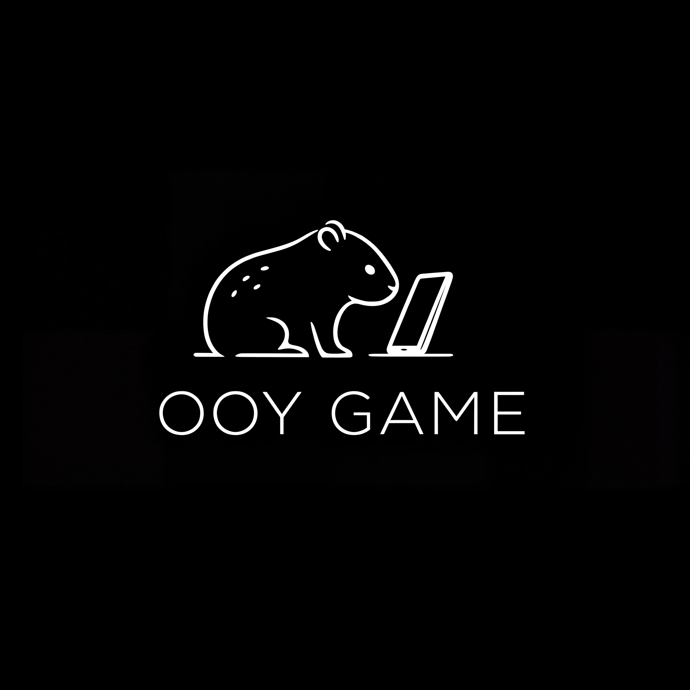

<div align="center">

# 

# OOY GAME

> **Estudio independiente de desarrollo de videojuegos móviles**  
> *"Creamos mundos pequeños con grandes experiencias"*


  
  
  
</div>

---

## 🎯 Nuestra Visión

Ser reconocidos por desarrollar **videojuegos móviles originales** que combinen diseño minimalista, identidad visual fuerte y experiencias que conecten emocionalmente con los jugadores.

---

## 🚀 Misión

Diseñar videojuegos para móviles que prioricen:

- ⚡ **Jugabilidad clara e inmediata**
- 🎨 **Estilo visual distintivo**
- 📱 **Rendimiento óptimo**
- 🎮 **Diversión sin sacrificar profundidad**

Crecemos juego a juego, aprendiendo y evolucionando junto a nuestra comunidad.

---

## 👥 El Equipo

Somos un colectivo de estudiantes y desarrolladores apasionados unidos por la creación de experiencias interactivas.

<div align="center">

| Miembro | Rol |
|:-------:|:---:|
| **[DaaNiieeL123](https://github.com/DaaNiieeL123)** | 💻 Programación & Gameplay |
| **[JairoGh](https://github.com/JairoGh)** | ⚙️ Sistemas & Arquitectura |
| **[Jsue46](https://github.com/Jsue46)** | 🧩 Lógica de Juego |

</div>

---

## 🕹️ Proyectos

<div align="center">

| Estado | Proyecto | Descripción |
|:------:|:---------|:------------|
| 🧪 | **Proyecto Inicial** | Primer videojuego móvil original de OOY GAME |
| 🔜 | **Futuros Títulos** | Expansión del catálogo en diversos géneros |

</div>

> Actualmente en fase de **prototipado**, enfocados en fundaciones sólidas e identidad.

---

## ✨ Filosofía de Diseño

```
🧠 Gameplay primero
🎨 Arte limpio y reconocible
⚡ Optimizado para móviles
🎵 Experiencias compactas pero memorables
🐾 Identidad visual coherente y simbólica
```

---

## 🛠️ Stack Tecnológico

- **Motor:** Unity / Godot
- **Lenguajes:** C#, GDScript
- **Control de versiones:** Git & GitHub
- **Arte:** Herramientas digitales según proyecto

---

## 🗺️ Roadmap

- [x] 🧩 Conceptualización del estudio
- [x] 🎨 Identidad visual y mascota
- [ ] 🧪 Prototipo jugable inicial
- [ ] 📱 Primer lanzamiento móvil
- [ ] 🌍 Publicación en tiendas digitales
- [ ] 🕹️ Expansión de catálogo

---

## 🤝 Colaboraciones

OOY GAME está abierto a colaborar con:

**Artistas** • **Diseñadores de Sonido** • **Programadores** • **Testers**

Si compartes nuestra visión, eres bienvenido.

---

## 📫 Contacto

- 📧 **Email:** ooygamedev@gmail.com
- 🌐 **Web:** Próximamente
- 🐙 **GitHub:** [OOY GAME Organization](https://github.com/OOY-GAME)

---

## 📄 Licencia

Los proyectos de OOY GAME se publicarán bajo licencias definidas por proyecto.  
Más detalles disponibles con los primeros lanzamientos.

---

<div align="center">

**"Pequeños detalles. Grandes juegos."**

*OOY GAME © 2025 - Todos los derechos reservados*

</div>